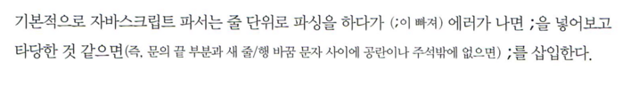
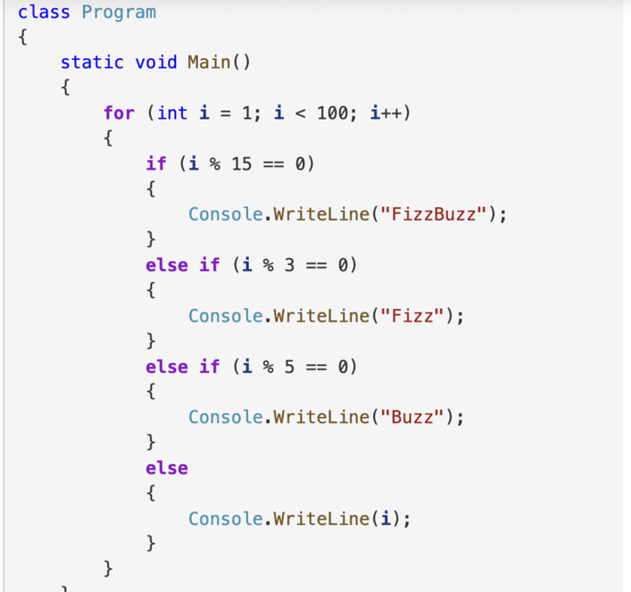
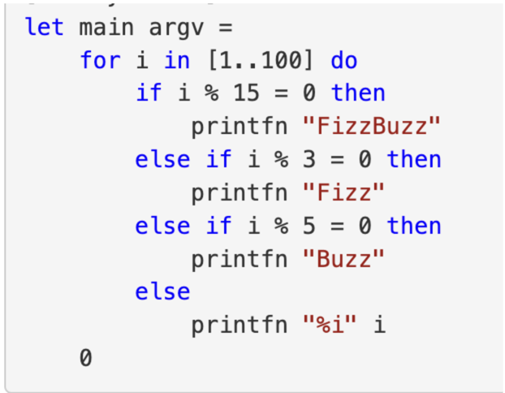

## 📚 읽은 내용
- TDZ
    - Temporal Dead Zone
    - 변수가 선언되기 이전의 영역
    - 이 영역에서 변수를 참조하려고 하면 에러가 발생
- try-catch-finally
    - finally는 항상 try, catch 이후에 실행된다
    - catch 없이 try, finally만 작성할 수 있다
    - finally에서 return을 작성하는 경우, try 또는 catch에서 throw하거나 return 하는 등의 비선형(Nonlinear) 제어문의 결과를 덮어씌운다
## 📚 느낀점
느낀점

- 이거 저만 귀엽나요

- ASI 가 세미콜론 자동으로 잘 추가해주니 의존하라는 급진 정책 또 내세울까봐 조마조마하면서 읽었다. 결론을 읽고나서 내가 왜 이런걸로 조마조마해야 하나 회의감이
- Significant whitespace는 무엇인가
    - Significant whitespace가 없는 경우
      - 
    - Significant whitespace가 있는 경우 (indentation이 스코프를 결정)
      - 
    - 내 생각에는 Significant whitespace 보다 중괄호 등으로 스코프를 만드는 것이 더 좋다
        - Significant whitespace 있는 편이 가독성은 더 좋을 수 있으나
        - indentation을 휴먼 에러로 잘못 추가하거나 제거하면.. 스코프가 바뀌어 버리는 참사가. 그런 것 신경쓰고 싶지 않다
        - [Significant whitespace is DRY](https://blog.ploeh.dk/2020/05/04/significant-whitespace-is-dry/)

- 구문 에러와 문법 에러는 무슨 차이인가
    - 구문 에러: syntax error → 일반 언어에서의 철자 오류와 비슷한 느낌. 잘못된 형태의(존재하지 않는 구문의) 코드인 경우
    - 문법 에러: 올바른 형태의 코드이지만 규칙상 허용되지 않는 경우
    - [https://www.quora.com/Is-a-syntax-error-a-grammatical-error](https://www.quora.com/Is-a-syntax-error-a-grammatical-error)

- try…finally
    - 마침내 재미있는 내용이
    - finally에서는 비선형 제어문 (return, throw 등) 사용하지 말자. 사용해야 더 좋은 경우가 생각나지 않음

## 📚 공유하고 싶은 부분(사이트)
