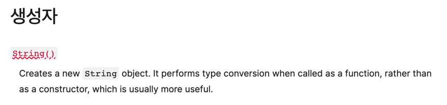
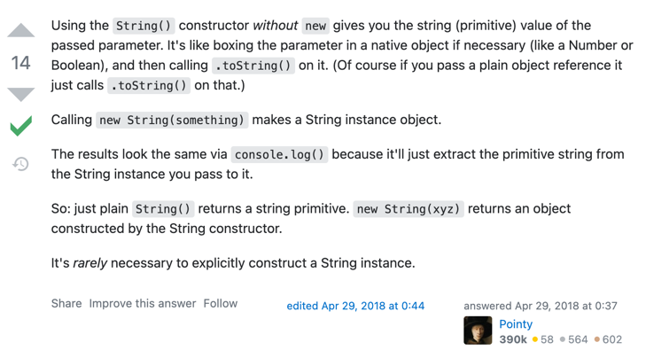

## 영(0) 
- -0의 개념을 만든 이유
  - 값의 크기로 어떤 정보와 그 값의 부호로 또 다른 정보를 동시에 나타내야 하는 애플리케이션이 있기 때문(잠재적인 정보 소실을 방지하기 위해 -0 개념을 만들었다)
- -0은 0과 동등 비교할 경우 False positive 결과가 나옴
  - 정확히 비교하려면 `Object.is` 사용

### 느낀점
- -0을 도입한 이유가 충분해 보이지 않는다. 이런 경우에는 직전 값을 함께 저장하는 식으로도 해결할 수 있을 것 같은데..

## 값 vs 레퍼런스
- 자바스크립트는 포인터라는 개념 자체가 없다
- 어떤 변수가 다른 변수를 참조할 수 없다. 그냥 안된다.ㅋㅋ
- 자바스크립트에서 레퍼런스는 공유된 값을 가리킨다. 레퍼런스 서로간의 레퍼런스나 포인터 따위는 없다.
- 자바스크립트에서는 값의 타입을 기준으로 값-복사, 레퍼런스-복사가 결정된다
  - Primitives(스칼라 원시) 값은 Pass by value
  - 그 외의 값은 Pass by reference
- 레퍼런스는 변수가 아닌 값 자체를 가리키므로 A 레퍼런스를 이용해서 B 레퍼런스가 다른 값을 가리키도록 변경할 수는 없다. (가리키는 값의 내용을 수정할 수는 있지만)
- 레퍼런스-복사 되는 경우를 값-복사로 전달하고 싶은 경우
  - 값의 사본을 전달하면 된다
- 값-복사 되는 경우를 레퍼런스-복사로 전달하고 싶은 경우
  - Primitives(스칼라 원시) 값을 객체나 배열 등으로 감싸야 한다

### 느낀점
- 정말 중요한 내용. 값을 전달할 때 Pass by value냐 reference냐 헷갈리지 않고, 그에대한 영향을 이해하려면 꼭 알아둬야 할 부분으로 보인다.

## 네이티브
- 네이티브라고 하는 내장 타입: ECMAScript 명세의 내장 객체
- 네이티브는 사실 내장 함수다
- 객체 래퍼로 직접 박싱하는 일은 필요할 일이 별로 없다
  - ex) new String()

## 📚 공유하고 싶은 부분(사이트)

### `new String()`과 `String()`은 어떻게 다른가
String()은 내장 함수인데, 함수 특성상 new 키워드와 함께 사용하면 생성자로서 동작하고 그렇지 않은 경우 일반 함수로 동작한다.

`new String()`을 호출하면 String 네이티브 객체가 생성되어 반환되고, `String()`을 호출하면 Primitive 값이 반환된다.(string 스칼라 원시 타입으로 타입 변환이 이루어진)

- https://developer.mozilla.org/ko/docs/Web/JavaScript/Reference/Global_Objects/String#%EC%83%9D%EC%84%B1%EC%9E%90
- https://stackoverflow.com/a/50082325

### WebStorm에서 md파일에 이미지 붙여넣기 잘되네요

