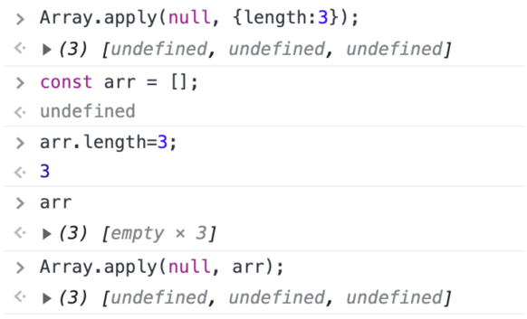

## 📚 읽은 내용
- 배열, 객체, 함수, 정규식 값은 리터럴로 생성해도 생성자 형식으로 만든 것과 동일한 종류의 객체를 생성한다.
- 스칼라 원시값에서 해당되는 객체 래퍼의 prototype의 속성을 호출할 경우, 원시값이 자동으로 해당 객체 래퍼로 박싱한 뒤에 호출된다.
- 네이티브 생성자는 정말 필요한 경우에만 사용하는 것이 좋다. 가급적이면 리터럴을 사용하라.
    - 객체 래퍼의 경우 (Primitive 값을 네이티브 생성자를 통해 명시적으로 감싸는 경우)
        - 필요한 경우 엔진이 알아서 박싱하므로 구태여 명시적으로 할 필요가 없다
        - 의도와 다른 결과가 발생할 수 있다
            - Boolean 같은 경우..
                - ex) `new Boolean(false)` 는 truthy 값
        - 엔진에 의한 최적화를 방해할 수 있다 (마이너 이슈)
    - 객체 래퍼가 아닌 경우 (배열, 객체, 함수, 정규식)
        - 생성자에서 인자들을 어떻게 처리하는지에 대한 이해가 잘못되었을 경우 문제가 발생할 수 있다
    - RegExp 생성자는 정규표현식을 동적으로 만드는 경우 필요하다
    - Date, Error는 리터럴 형식이 없다
- 배열의 빈 슬롯은 undefined가 할당된 슬롯과 다르게 동작할 수도 있다
    - map과 join의 동작이 다르다.
        - map의 경우 빈 슬롯은 순회하지 않는다.
- apply()는 모든 함수에서 사용 가능한 유틸리티
- 빈 슬롯 배열 만들지 마라

## 📚 느낀점
### 1. `Array.apply(null, { length: 3 })`에서 `{ length:3 }`이 HACK이였다니

가끔 n번 어떤 동작을 실행~ 혹은 n개의 아이템을 갖는 배열 생성~ 과 같은 동작이 필요할 때 검색을 하면 나오던 코드였는데, 여기에서 length가 Array 함수에서 받는 옵션값 정도인줄로 알고있었다. 사실은 ‘배열'인척 하기 위한 꼼수였다니, 뒤통수가 얼얼하다.

```ts
// 이 코드가
Array.apply(null, { length:3 });

// 이 코드를 흉내 내려던 거였구나
const arr = [];
arr.length = 3;
Array.apply(null, arr);
```


### 2. `네이티브 프로토타입을 디폴트로 이용하기` 쿨하지만 굳이 😅

가독성 측면에서도, 이후 휴먼에러 발생가능성이 높다는 측면에서도 손해가 더 큰 방식으로 보인다. 특히 성능상 이점은 얼마나 의미 있을까 의문이 들었고, 굳이 이렇게 할 필요가 없어 보인다.

## 📚 공유하고 싶은 부분(사이트)


