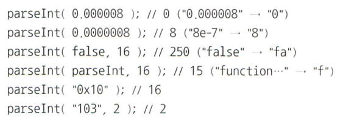

## 📚 읽은 내용
- 명시적 강제변환
    - 문자열 ↔ 숫자
        - String(), Number() 사용하는 걸 추천
        - .toString()은?
            - number 값을 객체 래퍼로 박싱하는 과정이 암시적으로 발생

## 📚 느낀점

- 강제변환 일관된 방식으로 하려면 함수 사용하자. 암시적인 방식에서 얻을 수 있는 것이 별로 없어보임.
- 변환에 있어서 만큼은 명시적일수록 좋아 보인다.
- ~(틸드) 연산을 -1 경계값 구분을 위해 사용하는 건 도리어 가독성을 해치는 일이 될 것 같다. 전용 함수를 하나 추가하는 편이 백번 나아 보인다.
- “쓰레기를 집어넣고 쓰레기를 돌려받았다고 해서 쓰레기통을 비난하지 말지어다”
    - 그럴 수도 있겠지만 나는 명백한 오류 상황이면 에러를 던져주는게 튼튼한 소프트웨어를 만드는 데 도움이 된다고 생각
- “놀랍지만 대단히 합리적인 parseInt”
    - 일관된 규칙에 의해 나온 결과일 수는 있어도 전혀 합리적으로 보이지 않는다. 이런 결과를 뱉지 말고 에러를 던져 주는 것이 더 합리적이지 않을까..

- Boolean() vs !!
    - !! 도 쿨하지만 Boolean()이 가독성 측면에서 이겼다는 내 생각
- 비트연산 재미있었지만 영양가가 없었다

## 📚 공유하고 싶은 부분(사이트)

