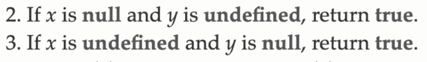
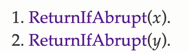

## 📚 읽은 내용
- == 연산자 로직(추상적 동등 비교 알고리즘)은 간단하다
    - 모든 가능한 타입별 조합마다 강제변환을 어떻게 수행하는지가 전부이고, 두 값의 타입이 같을 때까지 강제변환한 후에 비교한다.
    - 주의를 요하는 예외
        - NaN은 자신과도 동등하지 않다
        - +0과 -0은 동등하지 않다
- 추상 동등 비교 (두 값의 타입이 다른 경우)(Abstract Equality Comparison Algorithm)
    - String ↔ Number
        - String 값을 Number로 강제변환 (ToNumber 추상 연산)
    - ?(Boolean이 아닌 모든 것) ↔ Boolean
        - Boolean값을 Number로 강제변환 (ToNumber 추상 연산)
        - 그 후 ? 값이 Number가 아닐 경우, ? ↔ Number 추상 동등 비교 시작
    - null ↔ undefined
        - 예외적으로 강제변환하지 않고 true를 반환
          - 
        - 추상 동등 비교시 null과 undefined는 같은 값으로 취급될 수 있다
    - Object ↔ Primitive
        - Object값이 Primitive(비객체)로 될때까지 강제변환 (ToPrimitive 추상 연산)
        - 그 후 Primitive ↔ Primitive 추상 동등 비교 시작

## 📚 느낀점
- ToPrimitve 추상 연산 다시 찾아보다가 Primitive 타입은 객체를 제외한 모든 타입을 이야기 한다는 것을 되새김
- 추상 동등 비교에 대해서 열심히 공부했지만 여전히 엄격 동등 비교를 사용할 예정이다. 이런 저런 예외 신경쓰고 싶지 않기 때문에
- 정말 중요한 것을 배우고 있는가 회의감이 들 때가 있었지만 내가 주력으로 사용하는 언어에 Deep dive한다는 느낌으로 악으로 깡으로 공부했다
- 언어 명세를 처음 찾아봤다

## 📚 공유하고 싶은 부분(사이트)
- 추상 동등 비교 알고리즘 명세
  - es5 (https://262.ecma-international.org/5.1/#sec-11.9.3)
  - es6 (https://262.ecma-international.org/6.0/#sec-abstract-equality-comparison)
    - 
      - 이런 절차가 앞에 추가되었는데, 읽어보니 두 표현식 중 하나가 흐름 제어 연산자인 경우에 대한 항목인 것 같다
