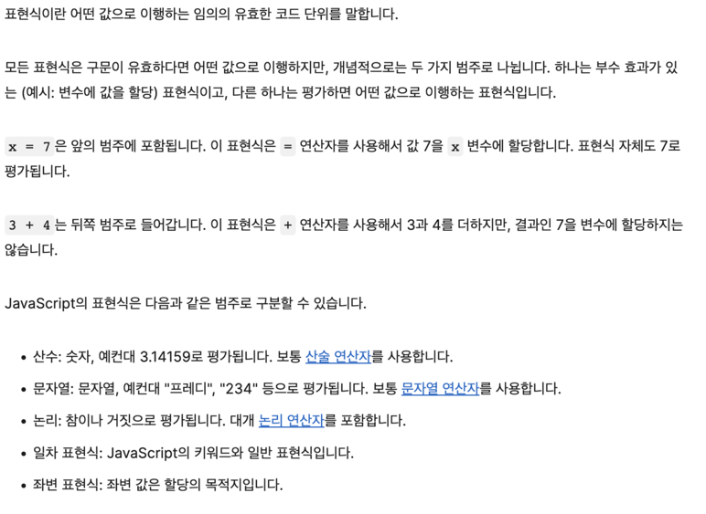

## 📚 읽은 내용
- 추상 관계 비교
    - 일단 두 피연산자에 ToPrimitive 연산
    - 둘 다 문자열이면 사전순 비교를
    - 어느 한쪽이라도 문자열이 아닐 경우 둘 다 ToNumber 연산
        - 숫자값으로 변환 후 비교
    - a ≤ b 는 a > b 결과값을 부정한 값
- 문법
    - 문 (Statement)
        - 하나 이상의 표현식으로 이루어진다
        - 표현식 문 (Expression Statement)
            - 하나의 표현식이 그 자체로 완전한 문을 이루는 경우
                - ex
                    - `b`
        - 문의 평가 결과는 항상 완료 값이다
            - = 모든 문은 완료 값을 가진다
        - 문의 완료 값을 포착하는 건 eval() 함수로 가능하다
    - 표현식 (Expression)
        - 모든 표현식은 단일한, 특정한 결괏값으로 계산된다
        - ex
            - `3 * 6`
        - 표현식은 부수 효과가 있는 것과 없는 것으로 나뉜다
            - 있는
                - `a++`
                - `a = 3`
                - `delete`
            - 없는
                - `a + 3`
## 📚 느낀점
- do 표현식은 stage 1에 머물러 있다는 것을 확인
- 문 완료값이 왜 중요한지도 적어줬다면 좋았을 텐데
    - 내 생각에는 별로 중요하지 않아보인다
- delete 연산자
    - 프로퍼티를 제거하는 것이 부수효과라니
- 연산자가 “부수 효과를 가진다”라고 생각해본적이 없었다. 할당 연산자면 할당이 주 효과 아닌가! ㅋㅋ

## 📚 공유하고 싶은 부분(사이트)
- An expression is any valid unit of code that resolves to a value.


## 같은 코드여도 Expression이냐 Statement이냐는 맥락에 따라 결정될 수 있다.

[https://stackoverflow.com/a/36456009](https://stackoverflow.com/a/36456009)

It is possible for the same (textual) block of code to be considered both an expression *and* a statement depending on the context. E.g. the text snippet `function f(){}` is an expression on line 1 and a statement in line 2 in the below code:

```
let g = function f() {};
function f() {};

```

So whether something is an expression or a statement cannot (in the general case) be determined by looking at a textual piece of code out of context; rather it is a property of a node in a syntax tree and can be decided only after the code is (mentally or actually) parsed.

## Expression으로서의 함수는 hoisting 되지 않고 Statement로서의 함수는 hoisting 된다
